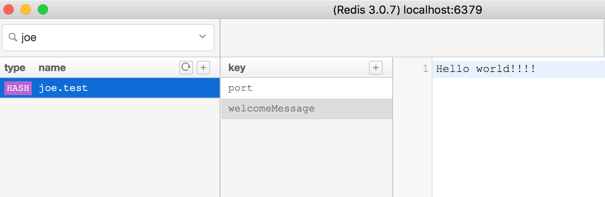

# Verx.x Redis Config

This project is to demonstrate the use of redis as an application config repository.

## Running the project

Once you have retrieved the project, you can check that everything works with:

```bash
./gradlew run
```

## Redis

Crate a new hash key `joe.test` in redis



port: 8080

welcomeMessage: Hello world!
